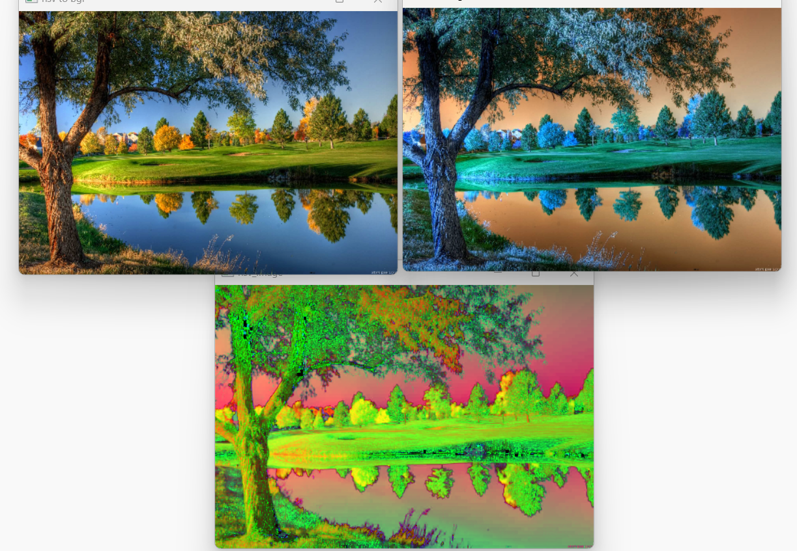
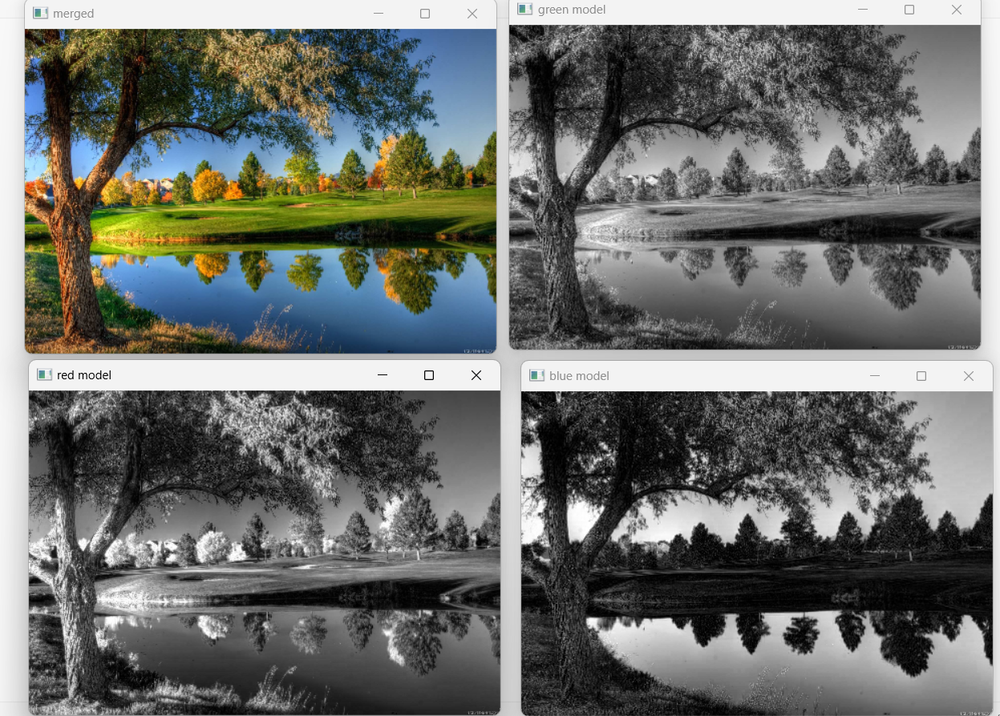
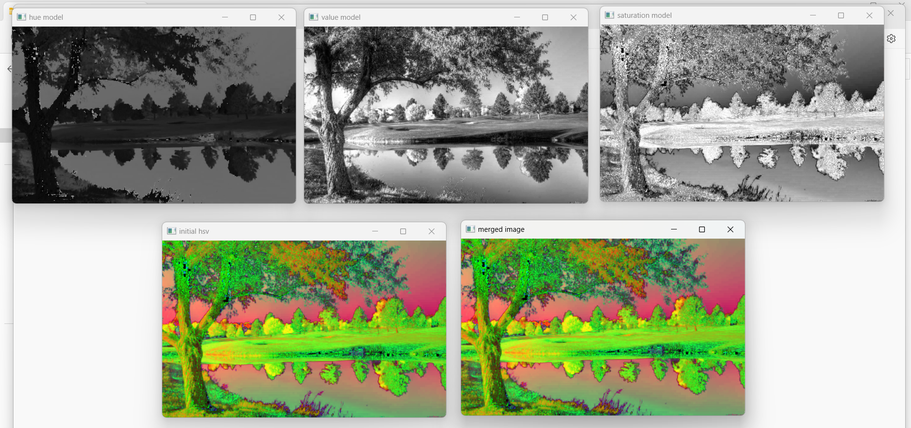

# Color Conversion
## AIM
To perform the color conversion between RGB, BGR, HSV, and YCbCr color models.

## Software Required:
Anaconda - Python 3.7
## Algorithm:
### Step1:
Import cv2 library and upload the image or capture an image.
<br>

### Step2:
Read the saved image using cv2.imread().
<br>

### Step3:
Convert the image into the given color transformation using cv2.cvtColor().
<br>

### Step4:
Split and merge the image using cv2.split() and cv2.merge()
<br>

### Step5:
Output the image using cv2.imshow()
<br>

## Program:
```python
# Developed By: KAVYA K
# Register Number:212222230065
# i) Convert BGR and RGB to HSV and GRAY

image=cv2.imread("result 1.PNG",1)
img= cv2.resize(image, (465,324))
cv2.imshow("original",img)

hsv_bgr=cv2.cvtColor(img,cv2.COLOR_BGR2HSV)
cv2.imshow("BGR to HSV",hsv_bgr)

hsv_rgb= cv2.cvtColor(img,cv2.COLOR_RGB2HSV)
cv2.imshow('RGB to HSV',hsv_rgb)

gray_bgr= cv2.cvtColor(img,cv2.COLOR_BGR2GRAY)
cv2.imshow('BGR2GRAY',gray_bgr)

gray_rgb= cv2.cvtColor(img,cv2.COLOR_RGB2GRAY)
cv2.imshow('RGB2GRAY',gray_rgb)

cv2.waitKey(0)
cv2.destroyAllWindows()


# ii)Convert HSV to RGB and BGR

image2 = cv2.imread("result5.PNG")
img2= cv2.resize(image2, (465,324))

hsv = cv2.cvtColor(img2, cv2.COLOR_BGR2HSV)
cv2.imshow("hsv_image", hsv)

hsv_rgb = cv2.cvtColor(hsv, cv2.COLOR_HSV2RGB)
cv2.imshow("hsv to rgb", hsv_rgb)

hsv_bgr = cv2.cvtColor(hsv, cv2.COLOR_HSV2BGR)
cv2.imshow("hsv to bgr", hsv_bgr)

cv2.waitKey(0)
cv2.destroyAllWindows()


# iii)Convert RGB and BGR to YCrCb

image3 = cv2.imread("result2.PNG")
img3= cv2.resize(image3, (470,324))

cv2.imshow("original(bgr)", img3)
img_ycrcb = cv2.cvtColor(img3 , cv2.COLOR_BGR2YCrCb)
cv2.imshow("bgr to YCrCb ", img_ycrcb)

img_rgb = cv2.cvtColor(img3, cv2.COLOR_BGR2RGB)
cv2.imshow("rgb", img_rgb)
img_bgr_y = cv2.cvtColor(img_rgb, cv2.COLOR_BGR2YCrCb)
cv2.imshow("rgb to YCrCb", img_bgr_y)
cv2.waitKey(0)
cv2.destroyAllWindows()


# iv)Split and Merge RGB Image

image4 = cv2.imread("result 3.PNG")
img4= cv2.resize(image4, (470,324))

b,g,r = cv2.split(img4)
cv2.imshow("red model", r)
cv2.imshow("green model", g)
cv2.imshow("blue model ", b)

merger = cv2.merge([b,g,r])
cv2.imshow("merged", merger )
cv2.waitKey(0)
cv2.destroyAllWindows()


# v) Split and merge HSV Image

image5 = cv2.imread("result4.PNG")
img5= cv2.resize(image5, (470,294))

hsv = cv2.cvtColor(img5 , cv2.COLOR_BGR2HSV)
cv2.imshow("initial hsv ", hsv)

h,s,v = cv2.split(hsv)
cv2.imshow("hue model", h)
cv2.imshow("saturation model", s)
cv2.imshow("value model ", v)

merger = cv2.merge([h,s,v])
cv2.imshow("merged image", merger )
cv2.waitKey(0)
cv2.destroyAllWindows()


```
## Output:
### i) BGR and RGB to HSV and GRAY
<br>

<br>

### ii) HSV to RGB and BGR

<br>

### iii) RGB and BGR to YCrCb
<br>

<br>

### iv) Split and merge RGB Image

<br>

### v) Split and merge HSV Image

<br>


## Result:
Thus the color conversion was performed between RGB, HSV and YCbCr color models.
